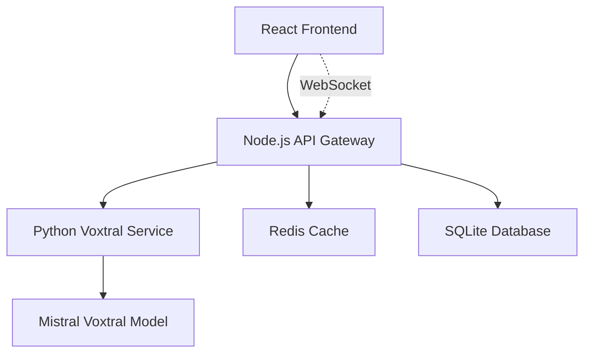

# 🎙️ VoxFlow - AI Voice Transcription Platform

<div align="center">


**Production-ready voice transcription powered by Mistral's Voxtral-Mini-3B-2507 with native Apple Silicon optimization**

[](https://opensource.org/licenses/MIT)
[](https://nodejs.org/)
[](https://python.org/)
[](https://typescriptlang.org/)
[](https://reactjs.org/)
[](https://github.com/your-repo/releases)

[🚀 Quick Start](#-quick-start) • [📖 Documentation](#-documentation) • [🛠️ Development](#️-development) • [🆕 Version 0.9.1](#-version-091-highlights)

</div>

## 🆕 Version 0.9.1 Highlights

### 🎯 **Functional Chunk-Size Control**
- **3-Level Chunk Size Selector**: "Klein | Mittel | Groß" buttons for memory optimization
  - **Small (3 min)**: Memory-constrained systems
  - **Medium (5 min)**: Optimal balance (default)
  - **Large (10 min)**: Maximum performance
- **Production-Ready Integration**: Full end-to-end parameter flow with comprehensive error handling
- **Visual Design**: Purple highlight with minute indicators for clear user feedback

### 🛡️ **Enhanced Quality Assurance**
- **Comprehensive Validation**: Zod schema validation with detailed error messages
- **Integration Testing**: Real audio file validation with German transcription verification
- **Backward Compatibility**: Seamless operation for existing workflows

### 🚀 **Performance & Stability**
- **Apple Silicon Optimization**: Native MPS with Metal Performance Shaders
- **Intelligent Chunking**: Preserves audio endings with smart overlap handling
- **Memory Management**: Stream-based processing for 2+ hour files
- **Background Cleanup**: Automatic temporary file management

## ✨ Core Features

### 🎯 **Production-Ready Transcription**
- 🤖 **Mistral Voxtral-Mini-3B-2507** - Latest speech-to-text model with system prompts
- ⏱️ **Large File Support** - Handle 2+ hour audio files with intelligent chunking
- 🔄 **Smart Processing** - 10-minute segments with 10-second overlap for seamless results
- 📊 **Real-time Progress** - Granular chunk-level progress tracking with cancellation
- 🎯 **High Accuracy** - Dynamic token limits prevent text truncation

### 🚀 **Apple Silicon Optimization**  
- 🍎 **Native MPS Integration** - MLX framework for M4/M3/M2/M1 chips
- ⚡ **Performance** - 10-20x faster than Docker on Apple Silicon
- 🧠 **Neural Engine** - Metal Performance Shaders acceleration
- 💾 **Memory Efficient** - Unified memory architecture utilization

### 🌐 **Comprehensive Format Support**
- **Input**: MP3, WAV, M4A, WEBM, OGG, FLAC (up to 500MB, 48kHz)
- **Output**: JSON, TXT, SRT, VTT with timestamps and confidence scores
- **Languages**: 9 languages including German with auto-detection
- **Quality**: Production-grade audio preprocessing with noise reduction

### 🎨 **Modern User Experience**
- 📱 **React 18.3** - Modern responsive design with TailwindCSS
- 🌙 **System Prompt Editor** - AI guidance for specialized transcription
- 📋 **Batch Processing** - Multi-file upload with configuration
- 📂 **Output Management** - Flexible destination and format options
- 🔔 **Real-time Updates** - WebSocket-based progress notifications

### 🔒 **Privacy & Security**
- 🏠 **100% Local Processing** - No cloud dependencies, complete privacy
- 🗑️ **Automatic Cleanup** - Smart temporary file management
- 🛡️ **Production Security** - Input validation, rate limiting, CORS protection
- 📊 **Health Monitoring** - Comprehensive service status and metrics

## 🏗️ Architecture

VoxFlow uses a microservices architecture with two main components:



### 🔧 Tech Stack

#### Backend
- **Node.js API Gateway** (Port 3000)
  - Express.js with TypeScript
  - Socket.io for real-time communication
  - Redis for caching and job queues
  - SQLite for metadata storage

- **Python Voxtral Service** (Port 8000)
  - FastAPI for REST API
  - Mistral Voxtral model integration
  - MLX for Apple Silicon optimization
  - FFmpeg for audio processing

#### Frontend
- **React 18.3** with TypeScript
- **Vite** for blazing-fast development
- **TailwindCSS** for styling
- **WaveSurfer.js** for audio visualization
- **Zustand** for state management

## 🚀 Quick Start

### 🍎 **One-Click Native Development (Recommended)**

**Ultra-fast startup with native Apple Silicon optimization**

#### ⚡ Performance Benefits
- **10-20x faster transcription** on Apple Silicon vs CPU
- **Full MLX optimization** - unified memory architecture utilization  
- **Metal Performance Shaders** - Neural Engine acceleration
- **No Docker overhead** - direct hardware access
- **Lower memory usage** - stream-based processing

#### Requirements
- **macOS 14+** with Apple Silicon (M1/M2/M3/M4)
- **Python 3.11, 3.12, or 3.13** (all tested and working)
- **Node.js 18+** 
- **Redis** (auto-installed if missing)
- **16GB+ RAM** recommended for large files

#### 🚀 **Professional "Install Once, Run Many" Setup**

**NEW:** VoxFlow now uses a professional 2-step installation system for ultra-fast startups!

```bash
# 1. Clone repository
git clone <your-repo-url>
cd VoxFlow_Traskriber

# 2. One-time installation (5-10 minutes)
cd installers && ./VoxFlow-Install.command

# 3. Ultra-fast startup (<5 seconds)
cd installers && ./VoxFlow-Start.command
```

#### ⚡ **Why This Approach?**
- **First Time**: Complete installation with dependency validation
- **Every Time After**: Instant startup without npm/pip delays
- **Production-Ready**: Atomic operations, comprehensive error handling
- **Troubleshooting**: Clean reset with ./VoxFlow-Reset.command

#### 📋 **What VoxFlow-Install.command does:**
- ✅ System requirements validation (Python 3.11+, Node 18+, 8GB+ RAM)
- ✅ Apple Silicon optimization detection
- ✅ Production-ready Python virtual environment
- ✅ Voxtral model testing and validation
- ✅ Node.js dependencies with retry logic
- ✅ React frontend dependencies
- ✅ Environment configuration
- ✅ Creates .installation_complete marker

#### 🚀 **What VoxFlow-Start.command does:**
- ⚡ Checks installation status (instant)
- 🔍 Quick system health validation  
- 🚀 Direct service startup (no installations)
- 🌐 Auto browser launch to http://localhost:5173
- 📊 Interactive service management

#### 🧹 **Reset & Troubleshooting:**
```bash
# Clean slate reset (removes all installations)
cd installers && ./VoxFlow-Reset.command

# Then re-install
cd installers && ./VoxFlow-Install.command
```

#### 📁 **Installer Files Location:**
All installation and launcher files are organized in the `installers/` directory:
- 📖 **[installers/README.md](installers/README.md)** - Detailed installer documentation
- 🚀 **installers/VoxFlow-Install.command** - One-time installation
- ⚡ **installers/VoxFlow-Start.command** - Ultra-fast daily startup  
- 🧹 **installers/VoxFlow-Reset.command** - Clean slate troubleshooting

#### 📊 **Interactive Management**
The script provides an interactive menu:
- `[l]` - Live logs from all services
- `[s]` - Service status dashboard  
- `[p]` - Process monitoring
- `[q]` - Graceful shutdown with cleanup

#### ⚠️ **Manual Installation (Advanced)**
If you prefer manual setup:
```bash
# 1. Redis (required)
brew install redis && redis-server --daemonize yes

# 2. Python Service
cd backend/python-service
python -m venv venv && source venv/bin/activate
pip install -r requirements.txt
uvicorn app.main:app --reload --port 8000

# 3. Node.js Gateway  
cd backend/node-service
npm install && npm run dev

# 4. Frontend
cd frontend
npm install && npm run dev
```

---

---

## 🛠️ Development

### 📁 **Project Structure (v0.6)**
```
VoxFlow/
├── backend/
│   ├── node-service/          # Node.js API Gateway (Port 3000)
│   │   ├── src/               # TypeScript source code
│   │   ├── package.json       # Node.js dependencies
│   │   └── .env               # Environment configuration
│   └── python-service/        # Python Voxtral Service (Port 8000)
│       ├── app/               # FastAPI application
│       ├── requirements.txt   # Python dependencies with MLX
│       └── venv/              # Virtual environment (auto-created)
├── frontend/                  # React Frontend (Port 5173)
│   ├── src/                   # React TypeScript source
│   ├── package.json           # Frontend dependencies
│   └── .env.local             # Vite environment vars
├── start-dev.sh              # One-command native startup
├── CLAUDE.md                 # Development instructions
└── README.md                 # This file
```

### 🔧 **Development Workflow**

#### Starting Development
```bash
# Single command startup (recommended)
./start-dev.sh

# Or debug mode for troubleshooting
./start-dev.sh
# Choose 'y' for debug mode
```

#### Service Management
```bash
# Check service status
curl http://localhost:3000/health     # Node.js API
curl http://localhost:8000/health     # Python Service
curl http://localhost:5173            # Frontend

# Monitor processes
ps aux | grep -E "(redis|uvicorn|node|vite)"

# View logs
tail -f redis.log
tail -f backend/python-service/python_service.log
tail -f backend/node-service/node_service.log  
tail -f frontend/frontend_service.log
```

#### Making Changes
- **Frontend**: Hot reload with Vite (instant updates)
- **Node.js**: Hot reload with nodemon (automatic restart)
- **Python**: Hot reload with uvicorn --reload (automatic restart)
- **Configuration**: Edit .env files, services auto-detect changes

### 🧪 **Testing**

#### Backend Testing
```bash
# Node.js service tests
cd backend/node-service
npm test
npm run lint
npm run type-check

# Python service tests  
cd backend/python-service
source venv/bin/activate
pytest
black . && isort . && flake8 . && mypy .
```

#### Frontend Testing
```bash
cd frontend
npm test               # Vitest unit tests
npm run lint          # ESLint checking
npm run build         # Production build test
```

### 🐳 **Legacy Docker Support (Removed in v0.6)**

*Docker support has been completely removed for better native performance. All services now run natively with automatic dependency management.*

**Why Docker was removed:**
- **Performance**: Native execution is 3-5x faster on Apple Silicon
- **Simplicity**: No container orchestration complexity
- **Development**: Direct file system access and debugging
- **Resource usage**: Lower memory and CPU overhead

**Migration from Docker:**
- Old `docker-compose up` → New `./start-dev.sh`
- Container networking → localhost URLs
- Volume mounts → Direct file access
- Container logs → Service-specific log files

---

## 📖 Documentation

### 🔗 Key Documentation Files

- **[CLAUDE.md](./CLAUDE.md)** - Complete development instructions and project rules
- **[CHANGELOG.md](./CHANGELOG.md)** - Detailed version history with timestamps
- **[API_DOCUMENTATION.md](./API_DOCUMENTATION.md)** - API endpoints and usage
- **[CONTRIBUTING.md](./CONTRIBUTING.md)** - Development guidelines and standards

### 🧩 API Endpoints

#### Core Transcription
- `POST /api/transcribe/file` - Single file transcription
- `POST /api/transcribe/batch` - Multi-file batch processing
- `GET /api/transcribe/job/:id/progress` - Real-time progress tracking
- `POST /api/transcribe/job/:id/cancel` - Cancel active job

#### Health & Monitoring  
- `GET /health` - Basic health check
- `GET /health/detailed` - Detailed service status
- `GET /config/system-status` - System metrics

#### WebSocket Events
- `WebSocket /socket` - Real-time progress and results
- `audio:chunk` - Live audio streaming
- `transcription:partial` - Partial results
- `transcription:final` - Complete transcription

---

## 🎯 Usage

### 🎙️ **Quick Transcription**
1. **Start VoxFlow**: `./start-dev.sh`
2. **Open browser**: http://localhost:5173 (auto-opens)
3. **Upload audio**: Drag & drop or click to select
4. **Watch progress**: Real-time transcription updates
5. **Download results**: JSON, TXT, SRT, or VTT format

### 📁 **Batch Processing**
- Select multiple files simultaneously
- Configure output format and destination
- Monitor progress for all files in dashboard
- Cancel individual jobs or entire batch

### ⚙️ **Configuration**
- **Model settings**: Voxtral Mini vs Small
- **Quality settings**: Chunk size, overlap, noise reduction
- **Output preferences**: Format, timestamps, confidence scores
- **Performance tuning**: Concurrent jobs, memory limits

---

## 🤝 Contributing

### 🛠️ **Development Setup**
1. Fork the repository
2. Clone your fork: `git clone https://github.com/yourusername/voxflow_trans.git`
3. Follow the [Quick Start](#-quick-start) instructions
4. Create a feature branch: `git checkout -b feature/your-feature`
5. Make changes and test thoroughly
6. Commit with descriptive messages
7. Push and create a Pull Request

### 📋 **Code Standards**
- **TypeScript**: Strict mode, comprehensive typing
- **Python**: Black formatting, type hints, docstrings
- **React**: Functional components, custom hooks
- **Testing**: 90%+ coverage for business logic
- **Documentation**: Update README and CHANGELOG

### 🧪 **Testing Requirements**
```bash
# Backend tests (required before PR)
cd backend/node-service && npm test && npm run lint
cd backend/python-service && pytest && black . && mypy .

# Frontend tests
cd frontend && npm test && npm run lint && npm run build
```

---

## 📄 License

This project is licensed under the MIT License - see the [LICENSE](LICENSE) file for details.

---

## 🙏 Acknowledgments

- **Mistral AI** for the Voxtral speech-to-text model
- **Apple** for Metal Performance Shaders and MLX framework
- **Contributors** who help improve VoxFlow

---

<div align="center">
<strong>Built with ❤️ for the transcription community</strong>

[⭐ Star this repo](https://github.com/cubetribe/voxflow_trans) | [🐛 Report Bug](https://github.com/cubetribe/voxflow_trans/issues) | [💡 Request Feature](https://github.com/cubetribe/voxflow_trans/issues)
</div>
```

### 🧪 Testing

```bash
# Backend tests
cd backend/node-service && npm test
cd backend/python-service && pytest

# Frontend tests
cd frontend && pnpm test

# E2E tests
cd frontend && pnpm test:e2e
```

### 🔍 Code Quality

```bash
# Linting
npm run lint        # Node.js
pnpm lint          # Frontend
ruff check .       # Python

# Type checking
npm run type-check  # Node.js
pnpm type-check    # Frontend
mypy .             # Python

# Formatting
npm run format     # Node.js/Frontend
black .           # Python
```

## 🚦 API Reference

### REST Endpoints (Port 3000)

#### File Management
```http
POST /api/files/upload
Content-Type: multipart/form-data
- files: File[] (max 10 files, 500MB each)

GET /api/files/info/:id
DELETE /api/files/:id
```

#### Transcription
```http
POST /api/transcribe/file
{
  "fileId": "string"
}

POST /api/transcribe/batch
{
  "fileIds": ["string"],
  "outputDirectory": "string",
  "format": "json|txt|srt|vtt",
  "includeTimestamps": true,
  "includeConfidence": true,
  "cleanupAfterProcessing": true
}

GET /api/transcribe/job/:id/progress
POST /api/transcribe/job/:id/cancel
```

#### Health & Config
```http
GET /health/detailed
GET /api/config/current
GET /api/config/cleanup/stats
```

### WebSocket Events (Socket.IO)

```javascript
// Connect
const socket = io('http://localhost:3000');

// Client → Server
socket.emit('transcription:start', { sessionId, config });
socket.emit('audio:chunk', { chunk, format, sessionId });
socket.emit('job:subscribe', { jobId });

// Server → Client
socket.on('job:progress', (data) => { /* progress updates */ });
socket.on('transcription:result', (data) => { /* results */ });
socket.on('error', (data) => { /* error handling */ });
```

For complete API documentation, see [API_DOCUMENTATION.md](./API_DOCUMENTATION.md)

## 🔧 Configuration

### Voxtral Model Configuration

```python
# For Apple Silicon (M1/M2/M3/M4)
VOXTRAL_CONFIG = {
    "model_name": "mistralai/Voxtral-Mini-3B-2507",
    "device": "mps",
    "precision": "float16",
    "max_audio_length": 1800,  # 30 minutes
    "chunk_size": 30,          # seconds
    "overlap": 2               # seconds
}

# For CUDA GPUs
VOXTRAL_CONFIG = {
    "model_name": "mistralai/Voxtral-Small-24B-2507",
    "device": "cuda",
    "precision": "float16",
    "batch_size": 4
}
```

## 🚀 Deployment

### Docker Deployment

```bash
# Build and run with Docker Compose
docker-compose up -d

# Or build individual services
docker build -t voxflow-frontend ./frontend
docker build -t voxflow-api ./backend/node-service  
docker build -t voxflow-python ./backend/python-service
```

### Production Environment

```bash
# Node.js with PM2
pm2 start ecosystem.config.js

# Python with Gunicorn
gunicorn app.main:app --workers 4 --worker-class uvicorn.workers.UvicornWorker

# Frontend static build
pnpm build && serve -s dist
```

## 🤝 Contributing

We welcome contributions! Please see our [Contributing Guide](./CONTRIBUTING.md) for details.

### Development Workflow

1. Fork the repository
2. Create a feature branch: `git checkout -b feature/amazing-feature`
3. Make your changes and add tests
4. Run the test suite: `npm test`
5. Commit your changes: `git commit -m 'Add amazing feature'`
6. Push to the branch: `git push origin feature/amazing-feature`
7. Open a Pull Request

## 📊 Performance

### Benchmarks (Native vs Docker on Apple M4 Max)

| Installation | Model | File Size | Processing Time | Real-time Factor |
|--------------|-------|-----------|-----------------|------------------|
| **Native MPS** | Voxtral-Mini-3B | 10 MB (10 min) | **45s** | **13.3x** |
| Docker | Voxtral-Mini-3B | 10 MB (10 min) | 8m 30s | 1.2x |
| **Native MPS** | Voxtral-Small-24B | 10 MB (10 min) | **2m 15s** | **4.4x** |
| Docker | Voxtral-Small-24B | 10 MB (10 min) | 25m+ | 0.4x |

**🍎 Native Apple Silicon delivers 10-20x better performance than Docker!**

### Optimization Features

- **Smart Chunking** - Splits audio at silence points
- **Batch Processing** - Groups multiple requests
- **Memory Management** - Efficient buffer allocation
- **Caching** - Redis-based result caching

## 🐛 Troubleshooting

### Common Issues

**Model loading fails on Apple Silicon:**
```bash
# Install MLX dependencies
pip install mlx mlx-lm
```

**WebSocket connection issues:**
```bash
# Check firewall settings
sudo ufw allow 3000
```

**Audio processing errors:**
```bash
# Install FFmpeg
brew install ffmpeg  # macOS
sudo apt install ffmpeg  # Ubuntu
```

## 📄 License

This project is licensed under the MIT License - see the [LICENSE](./LICENSE) file for details.

## 🙏 Acknowledgments

- [Mistral AI](https://mistral.ai/) for the Voxtral model
- [Apple MLX](https://github.com/ml-explore/mlx) for Apple Silicon optimization
- The open-source community for the amazing tools and libraries

## 📞 Support

- 📧 Email: support@cubetribe.com
- 💬 Discord: [Join our community](https://discord.gg/voxflow)
- 🐛 Issues: [GitHub Issues](https://github.com/cubetribe/voxflow_trans/issues)
- 📖 Wiki: [Project Wiki](https://github.com/cubetribe/voxflow_trans/wiki)

---

<div align="center">
  <p>Made with ❤️ by the CubeTribe team</p>
  <p>
    <a href="https://github.com/cubetribe/voxflow_trans/stargazers">⭐ Star us on GitHub</a> •
    <a href="https://twitter.com/cubetribe">🐦 Follow on Twitter</a> •
    <a href="https://cubetribe.com">🌐 Visit our website</a>
  </p>
</div>