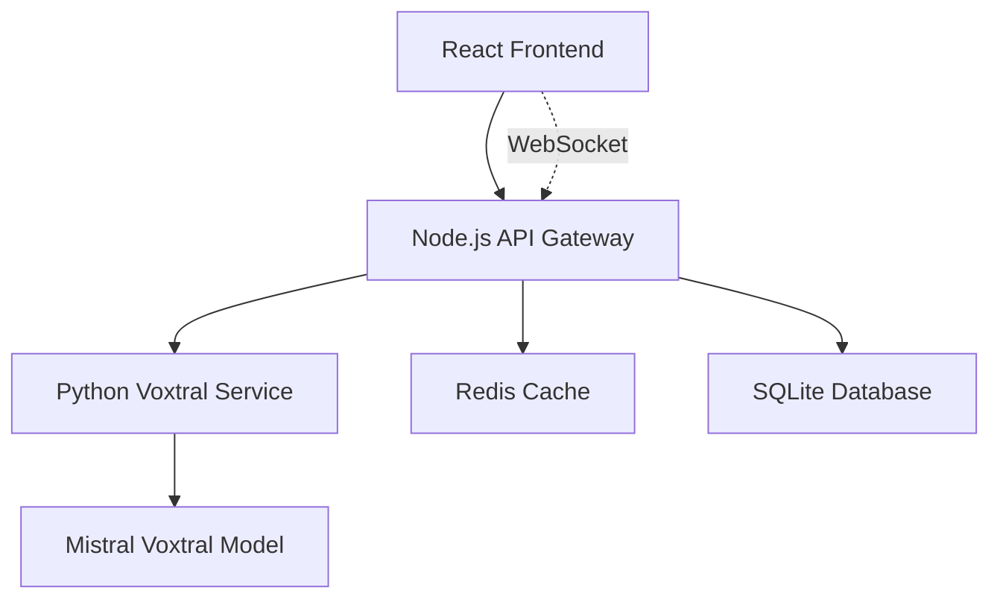

# 🎙️ VoxFlow - AI Voice Transcription

<div align="center">


**Next-generation voice transcription powered by Mistral's Voxtral model**

[](https://opensource.org/licenses/MIT)
[](https://nodejs.org/)
[](https://python.org/)
[](https://typescriptlang.org/)
[](https://reactjs.org/)

[🚀 Quick Start](#-quick-start) • [📖 Documentation](#-documentation) • [🛠️ Development](#️-development) • [🤝 Contributing](#-contributing)

</div>

## ✨ Features

- 🎯 **Real-time Transcription** - Live audio streaming with instant results
- 🔄 **Batch Processing** - Upload and process multiple audio files
- 🎨 **Modern UI** - Apple-inspired design with dark/light themes
- 🚀 **Apple Silicon Optimized** - MLX integration for M-series chips
- 🌐 **Multi-format Support** - MP3, WAV, M4A, WEBM, OGG
- 📱 **Responsive Design** - Works seamlessly on desktop and mobile
- 🔒 **Privacy First** - Local processing, no data leaves your system
- 📊 **Advanced Analytics** - Confidence scores and speaker detection

## 🏗️ Architecture

VoxFlow uses a microservices architecture with two main components:



### 🔧 Tech Stack

#### Backend
- **Node.js API Gateway** (Port 3000)
  - Express.js with TypeScript
  - Socket.io for real-time communication
  - Redis for caching and job queues
  - SQLite for metadata storage

- **Python Voxtral Service** (Port 8000)
  - FastAPI for REST API
  - Mistral Voxtral model integration
  - MLX for Apple Silicon optimization
  - FFmpeg for audio processing

#### Frontend
- **React 18.3** with TypeScript
- **Vite** for blazing-fast development
- **TailwindCSS** for styling
- **WaveSurfer.js** for audio visualization
- **Zustand** for state management

## 🚀 Quick Start

### Prerequisites

- **Node.js** 18.x or higher
- **Python** 3.9 or higher
- **pnpm** (recommended) or npm
- **Redis** server
- **FFmpeg** for audio processing

### Installation

1. **Clone the repository**
   ```bash
   git clone https://github.com/cubetribe/voxflow_trans.git
   cd voxflow_trans
   ```

2. **Set up the backend services**
   
   **Node.js API Gateway:**
   ```bash
   cd backend/node-service
   npm install
   cp .env.example .env
   npm run dev
   ```

   **Python Voxtral Service:**
   ```bash
   cd backend/python-service
   python -m venv venv
   source venv/bin/activate  # On Windows: venv\Scripts\activate
   pip install -r requirements.txt
   cp .env.example .env
   uvicorn app.main:app --reload --port 8000
   ```

3. **Set up the frontend**
   ```bash
   cd frontend
   pnpm install
   cp .env.example .env.local
   pnpm dev
   ```

4. **Access the application**
   - Frontend: http://localhost:5173
   - API Gateway: http://localhost:3000
   - Python Service: http://localhost:8000

## 📖 Documentation

### 📁 Project Structure

```
voxflow_trans/
├── 📁 backend/
│   ├── 📁 node-service/          # API Gateway
│   │   ├── 📁 src/
│   │   │   ├── 📁 controllers/   # Route handlers
│   │   │   ├── 📁 services/      # Business logic
│   │   │   ├── 📁 middleware/    # Express middleware
│   │   │   └── 📁 sockets/       # WebSocket handlers
│   │   └── 📄 package.json
│   └── 📁 python-service/        # Voxtral Processing
│       ├── 📁 app/
│       │   ├── 📁 api/           # FastAPI endpoints
│       │   ├── 📁 core/          # Core engine
│       │   └── 📁 services/      # Processing services
│       └── 📄 requirements.txt
├── 📁 frontend/                  # React Application
│   ├── 📁 src/
│   │   ├── 📁 components/        # React components
│   │   ├── 📁 hooks/             # Custom React hooks
│   │   ├── 📁 services/          # API clients
│   │   └── 📁 stores/            # State management
│   └── 📄 package.json
├── 📁 docs/                      # Additional documentation
├── 📄 README.md
├── 📄 CONTRIBUTING.md
└── 📄 CLAUDE.md                  # Claude Code guidance
```

### 🔗 Related Documentation

- [Backend Architecture](./voxtral-backend.md) - Detailed backend service documentation
- [Frontend Stack](./voxtral-frontend.md) - Frontend development guide
- [UI/UX Design](./voxtral-ui.md) - Design system and components
- [Claude Code Guide](./CLAUDE.md) - AI development assistance

## 🛠️ Development

### Environment Variables

#### Node.js Service (.env)
```env
PORT=3000
REDIS_URL=redis://localhost:6379
DATABASE_URL=sqlite:./data/voxflow.db
PYTHON_SERVICE_URL=http://localhost:8000
JWT_SECRET=your-secret-key
```

#### Python Service (.env)
```env
PORT=8000
MODEL_NAME=mistralai/Voxtral-Mini-3B-2507
DEVICE=mps  # For Apple Silicon
MAX_AUDIO_LENGTH=1800  # 30 minutes
CHUNK_SIZE=30
```

#### Frontend (.env.local)
```env
VITE_API_URL=http://localhost:3000
VITE_WS_URL=ws://localhost:3000
VITE_MAX_FILE_SIZE=500
```

### 🧪 Testing

```bash
# Backend tests
cd backend/node-service && npm test
cd backend/python-service && pytest

# Frontend tests
cd frontend && pnpm test

# E2E tests
cd frontend && pnpm test:e2e
```

### 🔍 Code Quality

```bash
# Linting
npm run lint        # Node.js
pnpm lint          # Frontend
ruff check .       # Python

# Type checking
npm run type-check  # Node.js
pnpm type-check    # Frontend
mypy .             # Python

# Formatting
npm run format     # Node.js/Frontend
black .           # Python
```

## 🚦 API Reference

### REST Endpoints

#### Transcription API
```http
POST /api/transcribe/upload
Content-Type: multipart/form-data

{
  "file": "audio.wav",
  "language": "auto",
  "format": "json"
}
```

#### WebSocket Events
```javascript
// Client -> Server
socket.emit('audio:chunk', audioBuffer);

// Server -> Client  
socket.on('transcription:partial', (data) => {
  console.log('Partial:', data.text);
});

socket.on('transcription:final', (data) => {
  console.log('Final:', data.text);
});
```

## 🔧 Configuration

### Voxtral Model Configuration

```python
# For Apple Silicon (M1/M2/M3/M4)
VOXTRAL_CONFIG = {
    "model_name": "mistralai/Voxtral-Mini-3B-2507",
    "device": "mps",
    "precision": "float16",
    "max_audio_length": 1800,  # 30 minutes
    "chunk_size": 30,          # seconds
    "overlap": 2               # seconds
}

# For CUDA GPUs
VOXTRAL_CONFIG = {
    "model_name": "mistralai/Voxtral-Small-24B-2507",
    "device": "cuda",
    "precision": "float16",
    "batch_size": 4
}
```

## 🚀 Deployment

### Docker Deployment

```bash
# Build and run with Docker Compose
docker-compose up -d

# Or build individual services
docker build -t voxflow-frontend ./frontend
docker build -t voxflow-api ./backend/node-service  
docker build -t voxflow-python ./backend/python-service
```

### Production Environment

```bash
# Node.js with PM2
pm2 start ecosystem.config.js

# Python with Gunicorn
gunicorn app.main:app --workers 4 --worker-class uvicorn.workers.UvicornWorker

# Frontend static build
pnpm build && serve -s dist
```

## 🤝 Contributing

We welcome contributions! Please see our [Contributing Guide](./CONTRIBUTING.md) for details.

### Development Workflow

1. Fork the repository
2. Create a feature branch: `git checkout -b feature/amazing-feature`
3. Make your changes and add tests
4. Run the test suite: `npm test`
5. Commit your changes: `git commit -m 'Add amazing feature'`
6. Push to the branch: `git push origin feature/amazing-feature`
7. Open a Pull Request

## 📊 Performance

### Benchmarks (Apple M4 Max)

| Model | File Size | Processing Time | Real-time Factor |
|-------|-----------|-----------------|------------------|
| Voxtral-Mini-3B | 10 MB (10 min) | 45s | 13.3x |
| Voxtral-Small-24B | 10 MB (10 min) | 2m 15s | 4.4x |

### Optimization Features

- **Smart Chunking** - Splits audio at silence points
- **Batch Processing** - Groups multiple requests
- **Memory Management** - Efficient buffer allocation
- **Caching** - Redis-based result caching

## 🐛 Troubleshooting

### Common Issues

**Model loading fails on Apple Silicon:**
```bash
# Install MLX dependencies
pip install mlx mlx-lm
```

**WebSocket connection issues:**
```bash
# Check firewall settings
sudo ufw allow 3000
```

**Audio processing errors:**
```bash
# Install FFmpeg
brew install ffmpeg  # macOS
sudo apt install ffmpeg  # Ubuntu
```

## 📄 License

This project is licensed under the MIT License - see the [LICENSE](./LICENSE) file for details.

## 🙏 Acknowledgments

- [Mistral AI](https://mistral.ai/) for the Voxtral model
- [Apple MLX](https://github.com/ml-explore/mlx) for Apple Silicon optimization
- The open-source community for the amazing tools and libraries

## 📞 Support

- 📧 Email: support@cubetribe.com
- 💬 Discord: [Join our community](https://discord.gg/voxflow)
- 🐛 Issues: [GitHub Issues](https://github.com/cubetribe/voxflow_trans/issues)
- 📖 Wiki: [Project Wiki](https://github.com/cubetribe/voxflow_trans/wiki)

---

<div align="center">
  <p>Made with ❤️ by the CubeTribe team</p>
  <p>
    <a href="https://github.com/cubetribe/voxflow_trans/stargazers">⭐ Star us on GitHub</a> •
    <a href="https://twitter.com/cubetribe">🐦 Follow on Twitter</a> •
    <a href="https://cubetribe.com">🌐 Visit our website</a>
  </p>
</div>