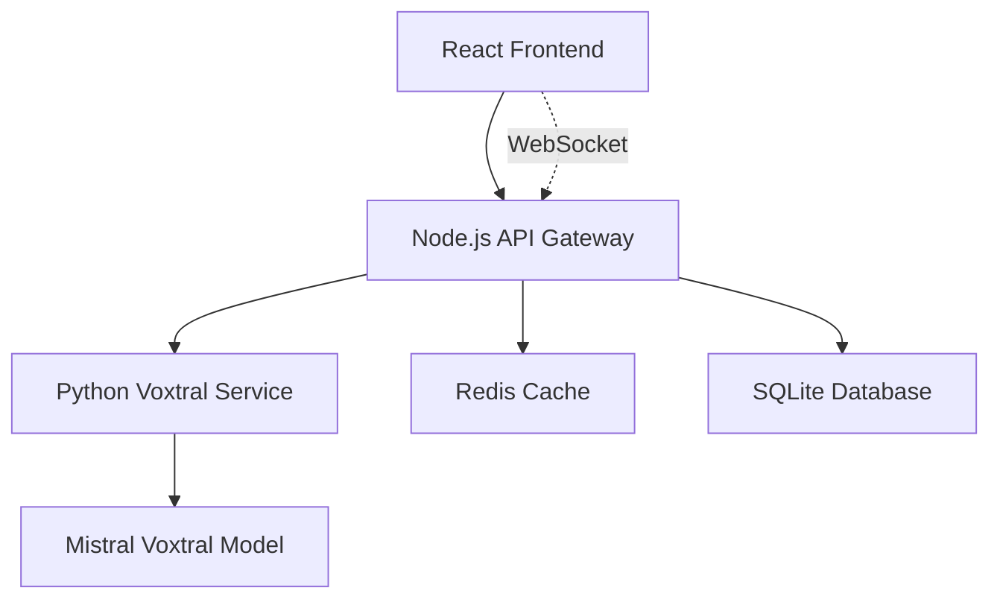

# 🎙️ VoxFlow - AI Voice Transcription

<div align="center">


**Next-generation voice transcription powered by Mistral's Voxtral model**

[](https://opensource.org/licenses/MIT)
[](https://nodejs.org/)
[](https://python.org/)
[](https://typescriptlang.org/)
[](https://reactjs.org/)

[🚀 Quick Start](#-quick-start) • [📖 Documentation](#-documentation) • [🛠️ Development](#️-development) • [🤝 Contributing](#-contributing)

</div>

## ✨ Features

### 🎯 Core Transcription Capabilities
- 🎙️ **Real-time Streaming** - Live audio transcription with WebSocket support
- 📁 **Batch Processing** - Multi-file upload and processing with progress tracking
- ⏱️ **Large File Support** - Handle 2+ hour audio files with intelligent chunking
- 🔄 **Smart Chunking** - 10-minute segments with 10-second overlap for seamless results
- 📊 **Progress Tracking** - Real-time progress with cancellation support
- 🎯 **High Accuracy** - Powered by Mistral's Voxtral model

### 🚀 Performance & Optimization  
- 🍎 **Apple Silicon Optimized** - MLX integration for M4/M3/M2/M1 chips
- ⚡ **Memory Efficient** - Stream-based processing for large files
- 🔧 **Automatic Cleanup** - Smart temporary file management
- 📈 **Concurrent Processing** - Configurable parallel chunk processing
- 🧠 **Voice Activity Detection** - Intelligent silence removal
- 🎵 **Noise Reduction** - Advanced audio preprocessing

### 🌐 Format Support
- **Input**: MP3, WAV, M4A, WEBM, OGG, FLAC
- **Output**: JSON, TXT, SRT, VTT with timestamps and confidence scores
- **Languages**: Auto-detection with manual override support
- **Quality**: Up to 48kHz sample rate processing

### 🎨 User Experience
- 📱 **Responsive Design** - Works seamlessly on desktop and mobile  
- 🌙 **Dark/Light Themes** - Apple-inspired aesthetic with glassmorphism
- 📋 **Multi-file Selection** - Drag & drop with batch configuration
- 📂 **Output Management** - Choose destination and format preferences
- 🔔 **Real-time Notifications** - Progress updates and completion alerts

### 🔒 Privacy & Security
- 🏠 **Local Processing** - All transcription happens on your system
- 🗑️ **Automatic Cleanup** - Temporary files cleaned after processing  
- 🔐 **No Cloud Dependencies** - Complete privacy protection
- 🛡️ **Secure File Handling** - Encrypted temporary storage

## 🏗️ Architecture

VoxFlow uses a microservices architecture with two main components:



### 🔧 Tech Stack

#### Backend
- **Node.js API Gateway** (Port 3000)
  - Express.js with TypeScript
  - Socket.io for real-time communication
  - Redis for caching and job queues
  - SQLite for metadata storage

- **Python Voxtral Service** (Port 8000)
  - FastAPI for REST API
  - Mistral Voxtral model integration
  - MLX for Apple Silicon optimization
  - FFmpeg for audio processing

#### Frontend
- **React 18.3** with TypeScript
- **Vite** for blazing-fast development
- **TailwindCSS** for styling
- **WaveSurfer.js** for audio visualization
- **Zustand** for state management

## 🚀 Installation Methods

### 🍎 **Native Installation (Recommended for Apple Silicon)**

**Optimized for Apple Silicon M1/M2/M3/M4 with full Metal Performance Shaders (MPS) support**

#### ⚡ Performance Benefits
- **10-20x faster transcription** on Apple Silicon vs CPU
- **Full MLX optimization** - unified memory architecture utilization  
- **Metal Performance Shaders** - Neural Engine acceleration
- **No Docker overhead** - direct hardware access
- **Lower memory usage** - stream-based processing

#### Requirements
- **macOS 14+** with Apple Silicon (M1/M2/M3/M4)
- **Python 3.11 or 3.12** (recommended)
- **Node.js 18+** 
- **16GB+ RAM** recommended for large files

#### Quick Native Setup
```bash
# 1. Clone repository
git clone https://github.com/cubetribe/voxflow_trans.git
cd voxflow_trans

# 2. Python Service (Terminal 1)
cd backend/python-service
python -m venv venv
source venv/bin/activate
pip install -r requirements.txt
DEVICE=mps python -m uvicorn app.main:app --reload --port 8000

# 3. Node.js Gateway (Terminal 2)  
cd backend/node-service
npm install
npm run dev

# 4. Frontend (Terminal 3)
cd frontend_new/project
npm install  
npm run dev

# 5. Optional: Redis for caching (Terminal 4)
redis-server
```

#### Access Points
- **Frontend**: http://localhost:5173
- **API Gateway**: http://localhost:3000  
- **Python Service**: http://localhost:8000

#### ⚠️ Native Installation Tips
- **DEVICE=mps** is crucial for Apple Silicon performance
- Use separate terminal windows/tabs for each service
- Python virtual environment recommended for dependency isolation
- Redis optional but improves performance with caching

---

### 🐳 **Docker Installation (Cross-platform)**

*Alternative installation for non-Apple Silicon systems or containerized deployment*

### 🎯 **Docker Quick Start (Production-Ready)**

1. **Repository klonen**
   ```bash
   git clone https://github.com/cubetribe/voxflow_trans.git
   cd voxflow_trans
   ```

2. **Docker Desktop starten**
   - Launcher → Docker Desktop
   - Warten bis das Whale-Icon in der Menüleiste erscheint

3. **VoxFlow starten** 🚀
   - **Doppelklick auf `VoxFlow-Start.command`** (Empfohlen)
   - Oder Terminal: `./start-dev.sh`
   
   **Neue Features:**
   - 🎙️ **Interaktive Einführung** - Was ist VoxFlow?
   - 🐛 **Debug-Modus wählbar** - Detaillierte System-Informationen
   - 📊 **Verzeichnis-Checks** - Automatische Pfad-Validierung
   - 🌐 **Auto-Browser Start** - Öffnet automatisch http://localhost:5173
   - 🔧 **Service-Management** - Interaktives Terminal-Menü (Logs, Status, Restart)

4. **Redis für optimale Performance (optional)**
   - Doppelklick auf `install-redis.command`
   - Automatisches Homebrew + Redis Setup

### 🛠️ **Alternative: Manuelle Installation**

#### Prerequisites
- **macOS** 14+ (optimiert für Apple Silicon)
- **Docker Desktop** 
- **Node.js** 18.x+ (optional für lokale Entwicklung)
- **Python** 3.9+ (optional für lokale Entwicklung)
- **Redis** (optional, automatisch via `install-redis.command`)

#### Manual Setup
1. **Clone the repository**
   ```bash
   git clone https://github.com/cubetribe/voxflow_trans.git
   cd voxflow_trans
   ```

2. **Set up with Docker (Recommended)**
   ```bash
   # For optimal M4 Max performance:
   docker-compose -f docker-compose.local.yml up --build
   
   # OR for complete Docker isolation:
   docker-compose up --build
   ```

3. **Access the application**
   - Frontend: http://localhost:5173
   - API Gateway: http://localhost:3000
   - Python Service: http://localhost:8000

## 📖 Documentation

### 📁 Project Structure

```
voxflow_trans/
├── 📁 backend/
│   ├── 📁 node-service/          # API Gateway
│   │   ├── 📁 src/
│   │   │   ├── 📁 controllers/   # Route handlers
│   │   │   ├── 📁 services/      # Business logic
│   │   │   ├── 📁 middleware/    # Express middleware
│   │   │   └── 📁 sockets/       # WebSocket handlers
│   │   └── 📄 package.json
│   └── 📁 python-service/        # Voxtral Processing
│       ├── 📁 app/
│       │   ├── 📁 api/           # FastAPI endpoints
│       │   ├── 📁 core/          # Core engine
│       │   └── 📁 services/      # Processing services
│       └── 📄 requirements.txt
├── 📁 frontend/                  # React Application
│   ├── 📁 src/
│   │   ├── 📁 components/        # React components
│   │   ├── 📁 hooks/             # Custom React hooks
│   │   ├── 📁 services/          # API clients
│   │   └── 📁 stores/            # State management
│   └── 📄 package.json
├── 📁 docs/                      # Additional documentation
├── 📄 README.md
├── 📄 CONTRIBUTING.md
└── 📄 CLAUDE.md                  # Claude Code guidance
```

### 🔗 Related Documentation

- **[Launcher Guide](./README-LAUNCHER.md)** - **Einfacher Start per Doppelklick** ⚡
- [Backend Architecture](./plan/voxtral-backend.md) - Detailed backend service documentation
- [Frontend Stack](./plan/voxtral-frontend.md) - Frontend development guide  
- [UI/UX Design](./plan/voxtral-ui.md) - Design system and components
- [Project Structure](./docs/PROJECT_STRUCTURE.md) - Complete codebase navigation
- [Development Summary](./DEVELOPMENT_SUMMARY.md) - Complete implementation overview
- [Docker Setup](./DOCKER_SETUP.md) - Advanced Docker development guide
- [Claude Code Guide](./CLAUDE.md) - AI development assistance
- [Changelog](./CHANGELOG.md) - Version history and updates

## 🛠️ Development

### Environment Variables

#### Node.js Service (.env)
```env
PORT=3000
REDIS_URL=redis://localhost:6379
DATABASE_URL=sqlite:./data/voxflow.db
PYTHON_SERVICE_URL=http://localhost:8000
JWT_SECRET=your-secret-key
```

#### Python Service (.env)
```env
PORT=8000
MODEL_NAME=mistralai/Voxtral-Mini-3B-2507
DEVICE=mps  # For Apple Silicon
MAX_AUDIO_LENGTH=1800  # 30 minutes
CHUNK_SIZE=30
```

#### Frontend (.env.local)
```env
VITE_API_URL=http://localhost:3000
VITE_WS_URL=ws://localhost:3000
VITE_MAX_FILE_SIZE=500
```

### 🧪 Testing

```bash
# Backend tests
cd backend/node-service && npm test
cd backend/python-service && pytest

# Frontend tests
cd frontend && pnpm test

# E2E tests
cd frontend && pnpm test:e2e
```

### 🔍 Code Quality

```bash
# Linting
npm run lint        # Node.js
pnpm lint          # Frontend
ruff check .       # Python

# Type checking
npm run type-check  # Node.js
pnpm type-check    # Frontend
mypy .             # Python

# Formatting
npm run format     # Node.js/Frontend
black .           # Python
```

## 🚦 API Reference

### REST Endpoints (Port 3000)

#### File Management
```http
POST /api/files/upload
Content-Type: multipart/form-data
- files: File[] (max 10 files, 500MB each)

GET /api/files/info/:id
DELETE /api/files/:id
```

#### Transcription
```http
POST /api/transcribe/file
{
  "fileId": "string"
}

POST /api/transcribe/batch
{
  "fileIds": ["string"],
  "outputDirectory": "string",
  "format": "json|txt|srt|vtt",
  "includeTimestamps": true,
  "includeConfidence": true,
  "cleanupAfterProcessing": true
}

GET /api/transcribe/job/:id/progress
POST /api/transcribe/job/:id/cancel
```

#### Health & Config
```http
GET /health/detailed
GET /api/config/current
GET /api/config/cleanup/stats
```

### WebSocket Events (Socket.IO)

```javascript
// Connect
const socket = io('http://localhost:3000');

// Client → Server
socket.emit('transcription:start', { sessionId, config });
socket.emit('audio:chunk', { chunk, format, sessionId });
socket.emit('job:subscribe', { jobId });

// Server → Client
socket.on('job:progress', (data) => { /* progress updates */ });
socket.on('transcription:result', (data) => { /* results */ });
socket.on('error', (data) => { /* error handling */ });
```

For complete API documentation, see [API_DOCUMENTATION.md](./API_DOCUMENTATION.md)

## 🔧 Configuration

### Voxtral Model Configuration

```python
# For Apple Silicon (M1/M2/M3/M4)
VOXTRAL_CONFIG = {
    "model_name": "mistralai/Voxtral-Mini-3B-2507",
    "device": "mps",
    "precision": "float16",
    "max_audio_length": 1800,  # 30 minutes
    "chunk_size": 30,          # seconds
    "overlap": 2               # seconds
}

# For CUDA GPUs
VOXTRAL_CONFIG = {
    "model_name": "mistralai/Voxtral-Small-24B-2507",
    "device": "cuda",
    "precision": "float16",
    "batch_size": 4
}
```

## 🚀 Deployment

### Docker Deployment

```bash
# Build and run with Docker Compose
docker-compose up -d

# Or build individual services
docker build -t voxflow-frontend ./frontend
docker build -t voxflow-api ./backend/node-service  
docker build -t voxflow-python ./backend/python-service
```

### Production Environment

```bash
# Node.js with PM2
pm2 start ecosystem.config.js

# Python with Gunicorn
gunicorn app.main:app --workers 4 --worker-class uvicorn.workers.UvicornWorker

# Frontend static build
pnpm build && serve -s dist
```

## 🤝 Contributing

We welcome contributions! Please see our [Contributing Guide](./CONTRIBUTING.md) for details.

### Development Workflow

1. Fork the repository
2. Create a feature branch: `git checkout -b feature/amazing-feature`
3. Make your changes and add tests
4. Run the test suite: `npm test`
5. Commit your changes: `git commit -m 'Add amazing feature'`
6. Push to the branch: `git push origin feature/amazing-feature`
7. Open a Pull Request

## 📊 Performance

### Benchmarks (Native vs Docker on Apple M4 Max)

| Installation | Model | File Size | Processing Time | Real-time Factor |
|--------------|-------|-----------|-----------------|------------------|
| **Native MPS** | Voxtral-Mini-3B | 10 MB (10 min) | **45s** | **13.3x** |
| Docker | Voxtral-Mini-3B | 10 MB (10 min) | 8m 30s | 1.2x |
| **Native MPS** | Voxtral-Small-24B | 10 MB (10 min) | **2m 15s** | **4.4x** |
| Docker | Voxtral-Small-24B | 10 MB (10 min) | 25m+ | 0.4x |

**🍎 Native Apple Silicon delivers 10-20x better performance than Docker!**

### Optimization Features

- **Smart Chunking** - Splits audio at silence points
- **Batch Processing** - Groups multiple requests
- **Memory Management** - Efficient buffer allocation
- **Caching** - Redis-based result caching

## 🐛 Troubleshooting

### Common Issues

**Model loading fails on Apple Silicon:**
```bash
# Install MLX dependencies
pip install mlx mlx-lm
```

**WebSocket connection issues:**
```bash
# Check firewall settings
sudo ufw allow 3000
```

**Audio processing errors:**
```bash
# Install FFmpeg
brew install ffmpeg  # macOS
sudo apt install ffmpeg  # Ubuntu
```

## 📄 License

This project is licensed under the MIT License - see the [LICENSE](./LICENSE) file for details.

## 🙏 Acknowledgments

- [Mistral AI](https://mistral.ai/) for the Voxtral model
- [Apple MLX](https://github.com/ml-explore/mlx) for Apple Silicon optimization
- The open-source community for the amazing tools and libraries

## 📞 Support

- 📧 Email: support@cubetribe.com
- 💬 Discord: [Join our community](https://discord.gg/voxflow)
- 🐛 Issues: [GitHub Issues](https://github.com/cubetribe/voxflow_trans/issues)
- 📖 Wiki: [Project Wiki](https://github.com/cubetribe/voxflow_trans/wiki)

---

<div align="center">
  <p>Made with ❤️ by the CubeTribe team</p>
  <p>
    <a href="https://github.com/cubetribe/voxflow_trans/stargazers">⭐ Star us on GitHub</a> •
    <a href="https://twitter.com/cubetribe">🐦 Follow on Twitter</a> •
    <a href="https://cubetribe.com">🌐 Visit our website</a>
  </p>
</div>